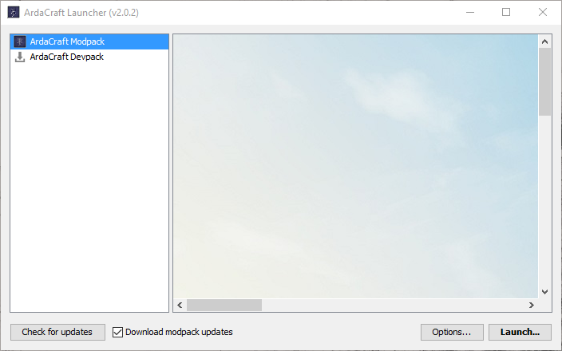
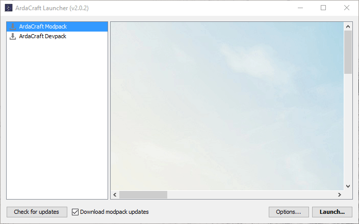

ArdaCraft Launcher
================
The ArdaCraft launcher is based on [SKCraft's](https://github.com/SKCraft/Launcher) with full credit to the SKCRaft team for developing the tools to make this launcher and modpack.

================

First things first. You must have [Java 64 bit](https://java.com/en/) installed for the launcher to work properly.

### Installation of the launcher

Here's a quick video on how to install the Launcher:

VIDEO HERE

Download the latest launcher [here](https://github.com/ArdaCraft/SKLauncher/releases/latest) It will download to whereever you've set the browser to download to.
Once downloaded click on the launcher '.exe' or '.jar'. It should look something like this:

Click on the ArdaCraft Modpack tab on the left of the launcher.

You will be prompted to use your Minecraft account login. Our launcher uses the same login as the default Minecraft launcher, and we do not see any of your information.
There will then be a prompt to select optional mods, you can select what you want to your liking, and we suggest you select the recommended mods.

The launcher will then download the needed packages, and depending on your internet speed, may take anywhere from a few seconds, to a few minutes.

When Minecraft launches, your Minecraft may be in the default resourcepack. This is done because the ArdaCraft resourcepack is quite large, and some people may have trouble loading it for the first time launching the modpack. You need to select the ArdaCraft resourcepack in the resourcepack options before you join the server.

Once your resourcepack is loaded you are ready to join the server! Go to multiplayer, and connect to the server via mc.ardacraft.me

Once you join, look around, talk to community members, and if you want to build, fill out a [builder application](http://ardacraft.me/application)

## License

The launcher is licensed under the GNU Lesser General Public License, version 3.
